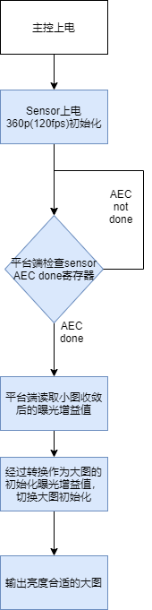
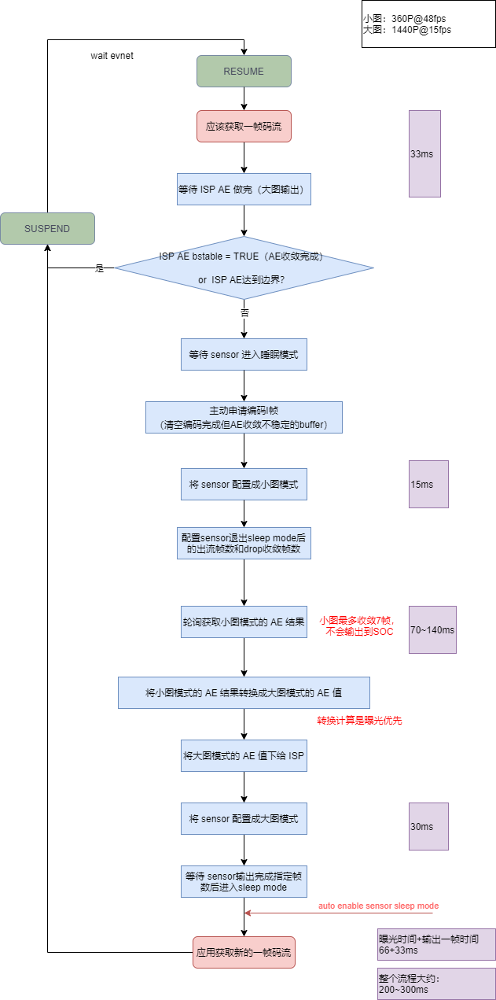
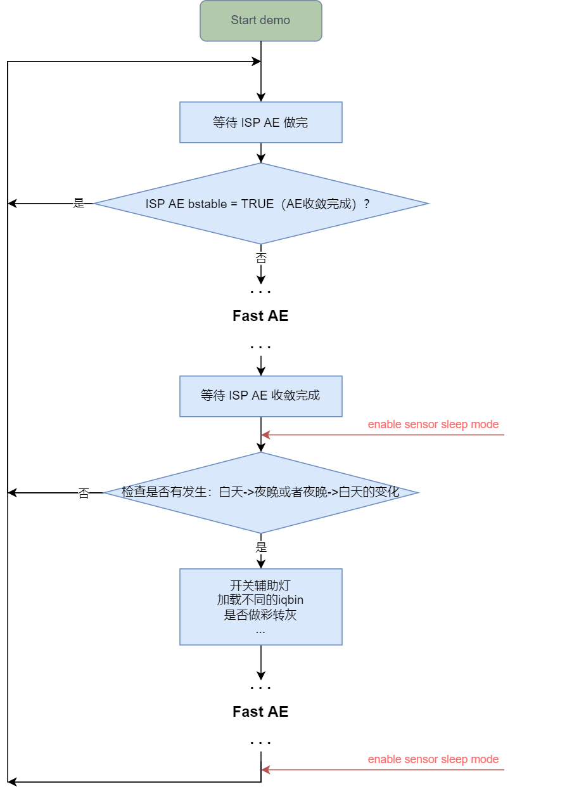
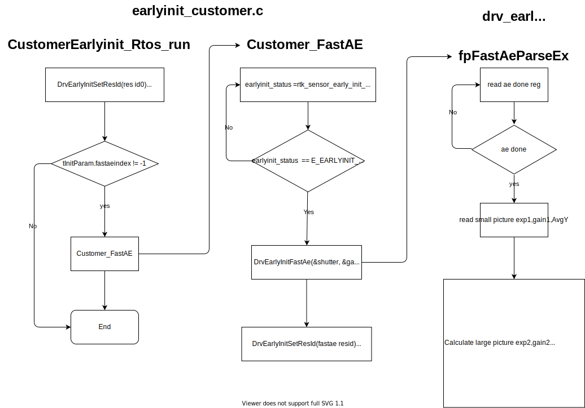

# Sensor FastAE说明

---


## 一、简介

### 1.1. sensor ae工作原理

Sensor FastAE是指Sensor硬件能支持自动做AE收敛。sensor以小分辨率高帧率的方式运行，sensor ae通过获取当前画面的亮度调整sensor曝光和增益设置，达到预期的目标亮度，保证在正常分辨率下输出第一张图像画面亮度正常。本文以当前支援的os04d10 sensor作为例子， 介绍sensor ae如何搭配平台工作。

### 1.2. sensor ae流程

主控初始化sensor小图高帧率设定，sensor内部做AE收敛，主控轮询sensor提供的ae stable寄存器，读取寄存器是ae stable的结果后，再读取小图收敛后的曝光和增益信息，通过转换计算得到大图的曝光增益。




## 二、04d10 fastae寄存器

下列是04d10 fastae相关的寄存器，仅供参考用于说明fastae支持获取的相关信息，实际以sensor datasheet说明为准。

| 寄存器（P代表寄存器所在page） | 说明                                       |
| ----------------------------- | ------------------------------------------ |
| P1: 0x22/0x23                 | 小图曝光值                                 |
| P1: 0x21                      | AE亮度统计值                               |
| P1: 0x24                      | 小图/大图模拟增益值                        |
| P5: 0x39/0x37                 | 小图/大图数字增益值                        |
| P1: 0x45                      | hcg/lcg mode（高倍模拟增益或低倍模拟增益） |
| P1: 0x03/0x04                 | 大图曝光值                                 |
| P2: 0x82                      | AE target                                  |
| P2: 0x7b[3:2] \| 0x77[7:0]    | AEC最大曝光值                              |
| P1: 0x33=0x03, 0x01=0x02      | 曝光/增益在下一帧立即生效                  |
| P1: 0x20                      | AEC done时置1                              |
| P5: 0xf0/0xf1/0xf2/0xf3       | sensor blc offset                          |

* 小图初始化时，根据场景设定小图的AE target值，AEC最大曝光值
  * AE target值一般与平台ISP AE target值一致。
  * AEC最大曝光值最大为1/48 s，小图支持120fps运行，在亮度达不到时自动降帧拉高曝光参数。

* 小图在AEC收敛过程中，不支持自动调整hcg/lcg mode，不支持调整数字增益值，假如有参考值，需要先在初始化时设定。
* 小图在AEC done后，平台端可以读取小图的曝光值、增益值、AE亮度统计值然后换算出大图合适的曝光和增益值。
* hcg/lcg mode的切换需要参考sensor的opt data寄存器值。
* Sensor AEC统计的亮度值没有扣blc，假如开启sensor blc会有sensor亮度统计值和ISP 亮度统计值差异问题，另外sensor blc offset会受到sensor dgain的影响，所以当前常规场景下会将sensor的blc offset设为0，此时isp也要相应将sensor OB设为0。


## 三、开发指南

### 3.1. AOV场景

#### 3.1.1. 工作流程

在低帧场景中，面对快速变化的环境光时，AE的收敛会比较慢，使用sensor自带的AE收敛功能不仅能节省硬光敏成本，同时又兼顾了AE收敛的时间。



当处理完一帧画面，即ISP AE做完之后，需要查询AE的收敛状态，当AE未收敛完成时（即收敛未稳定，bIsStable为false），即可开始让sensor做Fast AE。

   - 若外部环境光轻微变化，ISP bstable的状态就发生了切换，则有几个方向可以优化：
     - 调整iq api bin里的ConvThdIn/ConvThdOut参数，即ISP的内收敛/外收敛范围。不过这样做的话，有可能会错过本该收敛的时机。
     - 根据实测，当外部环境光只是轻微变化时，只依靠ISP的收敛即可，不需要fast ae参与，尤其考虑到fast ae的耗时和功耗。所以在发现AE未收敛时，可以再判断`stAeExpoInfo.stHistWeightY.u32AvgY`和`stAeExpoInfo.u32SceneTarget`之间的差值，如果差别不大，且图像效果可以接受，那就不用启用fast ae，此时因为ISP bstable为false，所以下一张会自动启用ISP收敛。这样既能保证效果，也能节省功耗。
   - 因为前一张的码流其AE不稳定，所以在亮度骤变时，这一张一般会偏暗或者偏亮，为了防止下一张（即做完fast ae后的图）的编码受到影响，可以主动申请编码I帧，来让编码效果更好。

#### 3.1.2. ISP接口配合

为了让Fast AE的效果更好，需要调用ISP如下两只接口：

1. MI_ISP_CUS3A_SetAESource接口设定将平台的ISP AE的统计值放置于AWB前，避免AWB gain差异影响ISP AE亮度统计值和sensor纯raw亮度统计值对齐。
2. MI_ISP_CUS3A_SetAeOpMode接口通知ISP当前是AOV场景下的sensor ae mode或是ISP AE normal mode，在低帧时需要设定为sensor ae mode，在高帧时需要设定为ISP AE normal mode

```
// Create ISP channel
MI_ISP_CreateChannel(u32IspDevId, u32IspChnId);

...

// Adjust the position of AE statistics (for fast ae)
CusAESource_e eAeSource = AE_SOURCE_FROM_SE_ALSC_AF_HDR;
MI_ISP_CUS3A_SetAESource(u32IspDevId, u32IspChnId, &eAeSource);

...

//set LowFps
if (E_ST_FPS_LOW == pstAovHandle->stAovPipeAttr.eFps)
{
	// Config to aov sensor AE mode (for fast ae)
	CusAeOpMode_e eCusAeOpMode = AE_OP_MODE_AOV_SENSOR_AE;
	MI_ISP_CUS3A_SetAeOpMode(u32IspDevId, u32IspChnId, &eCusAeOpMode);

	// Configure Sensor to enable sleep mode & consecutive frames cnt
	pstAovHandle->stSNRSleepParam.bSleepEnable           = TRUE;
	pstAovHandle->stSNRSleepParam.u32FrameCntBeforeSleep = 1; 

	MI_VIF_CustFunction(u32VifDevId,E_MI_VIF_CUSTCMD_SLEEPPARAM_SET, sizeof(ST_Common_SNRSleepParam_t),
						&pstAovHandle->stSNRSleepParam);
}
//set HighFps
else if (E_ST_FPS_HIGH == pstAovHandle->stAovPipeAttr.eFps)
{
    CusAeOpMode_e eCusAeOpMode = AE_OP_MODE_NORMAL;
    MI_ISP_CUS3A_SetAeOpMode(u32IspDevId, u32IspChnId, &eCusAeOpMode);

    // Configure Sensor to disable sleep mode
    pstAovHandle->stSNRSleepParam.bSleepEnable = FALSE;
    MI_VIF_CustFunction(u32VifDevId, E_MI_VIF_CUSTCMD_SLEEPPARAM_SET,
							sizeof(ST_Common_SNRSleepParam_t), &pstAovHandle->stSNRSleepParam);
}
```


#### 3.1.3. FastAE接口说明

Fast AE的流程如3.1.1节介绍，其中每一个步骤，都有对应的API可以直接调用，也可以参考Sigmastar平台的做法，使用封装好的接口完成整个流程的处理。

##### 3.1.3.1 完整处理流程接口

| API                                | 功能                                 |
| ---------------------------------- | ------------------------------------ |
| ST_Common_FastAE_InitPipelineParam | 初始化Fast AE的Pipeline参数          |
| ST_Common_FastAE_InitIspConvParam  | 初始化Fast AE的Isp收敛策略参数       |
| ST_Common_FastAE_Run               | 检查AE状态启动Fast AE                |
| ST_Common_FastAE_UpdateDNIqBin     | 检查白天夜晚切换加载IQ Bin(预留接口) |

可参考如下流程：

1、APP初始化Pipeline、调用ST_Common_FastAE_InitPipelineParam接口，初始化Fast AE的Pipeline参数并调用ST_Common_FastAE_InitIspConvParam接口初始化Fast AE的Isp收敛策略参数。

2、在系统resume起来后，APP在取得码流前调用ST_Common_FastAE_Run，该接口会检查是否要启动Fast AE并运行。然后再取得新的一帧码流。

**ST_Common_FastAE_InitPipelineParam**

  - 功能

    初始化Fast AE的Pipeline参数

  - 语法

    ```
    MI_S32 ST_Common_FastAE_InitPipelineParam(ST_Pipeline_Param *pstPipelineParam)
    ```

  - 形参

    | **参数名称**     | **描述**             | **输入/输出** |
    | ---------------- | -------------------- | ------------- |
    | pstPipelineParam | Fast AE Pipeline参数 | 输入          |

  - 返回值

    0：成功

    非0：失败

  - 备注

    仅支持单Sensor Fast AE场景。

**ST_Common_FastAE_InitIspConvParam**

  - 功能

    初始化Fast AE的ISP收敛策略参数

  - 语法

    ```
    MI_S32 ST_Common_FastAE_InitIspConvParam(MI_U32 u32StreamOutCnt, MI_U32 u32DropCnt, MI_U32 u32RunThreshold)
    ```

  - 形参

    | **参数名称**    | **描述**                                                     | **输入/输出** |
    | --------------- | ------------------------------------------------------------ | ------------- |
    | u32StreamOutCnt | Fast AE完成后，Sensor输出帧数                                | 输入          |
    | u32DropCnt      | Fast AE完成后，丢弃帧数；<br/>实际输出到用户层帧数等于u32StreamOutCnt减去u32DropCnt | 输入          |
    | u32RunThreshold | Fast AE启动阈值，判断`stAeExpoInfo.stHistWeightY.u32AvgY`和`stAeExpoInfo.u32SceneTarget`之间的差值，决定是否要启动Fast AE | 输入          |

  - 返回值

    0：成功

    非0：失败

  - 备注

    可以根据实测场景调整收敛策略参数，从而调整FastAE处理时间和图像效果。

**ST_Common_FastAE_Run**

  - 功能

    检查AE状态启动Fast AE

  - 语法

    ```
    MI_S32 ST_Common_FastAE_Run(MI_BOOL *pbIsDoFastAE);
    ```

  - 形参

    | **参数名称** | **描述**          | **输入/输出** |
    | ------------ | ----------------- | ------------- |
    | pbIsDoFastAE | Fast AE是否有启动 | 输入/输出     |

  - 返回值

    0：成功

    非0：失败

  - 备注

    无

**ST_Common_FastAE_UpdateDNIqBin**

  - 功能

    检查白天夜晚切换加载IQ Bin(预留接口)

  - 语法

    ```
    MI_S32 ST_Common_FastAE_UpdateDNIqBin(FASTAE_EnvBrightnessType_e *peCurrentLight,char *pu8IqApiBinDarkPath, char *pu8IqApiBinBrightPath);
    ```

  - 形参

    | **参数名称**          | **描述**              | **输入/输出** |
    | --------------------- | --------------------- | ------------- |
    | peCurrentLight        | 当前白天夜晚状态      | 输入/输出     |
    | pu8IqApiBinDarkPath   | 夜晚的isp api bin路径 | 输入          |
    | pu8IqApiBinBrightPath | 白天的isp api bin路径 | 输入          |

  - 返回值

    0：成功

    非0：失败

  - 备注

    预留接口，用于调试场景变化的更优效果。

##### 3.1.3.2 内部实现接口

以下会说明fast_ae.c中关键接口的实现，对于控制sensor部分的切换小图、polling AEC、切换大图，主要依赖MI_SNR_CustFunction调用到sensor driver进而控制sensor。

| API                                    | 功能                                          |
| -------------------------------------- | --------------------------------------------- |
| ST_Common_FastAE_EnableSensorSleepMode | 设置sensor进入sleepmode                       |
| ST_Common_FastAE_WaitSensorSleep       | 等待sensor进入sleepmode                       |
| ST_Common_FastAE_ConfigToSmallPic      | 设置sensor切换到小图模式                      |
| ST_Common_FastAE_SetFroceStreamOutCnt  | 唤醒sensor退出sleepmode输出指定帧数后自动睡眠 |
| ST_Common_FastAE_GetSmallPicAeResult   | 获取小图AEC结果                               |
| ST_Common_FastAE_ConvertFastAeResult   | 将小图的AEC曝光增益信息转换成大图的曝光增益值 |
| ST_Common_FastAE_SetToISP              | 将大图的曝光增益值设置到ISP                   |
| ST_Common_FastAE_ConfigToFullPic       | 设置sensor切换到大图模式                      |
| ST_Common_FastAE_WaitIspConvToStable   | 等待ISP收敛结果                               |

**ST_Common_FastAE_EnableSensorSleepMode**

  - 功能

    设置sensor进入sleepmode

  - 详解

    无


**ST_Common_FastAE_WaitSensorSleep**

  - 功能

    等待sensor进入sleepmode

  - 详解

    该接口会阻塞的等待sensor进入sleepmode。sensor进入sleepmode后，平台内部处理的buffer也会消耗完成，这时候控制sensor才能保证不影响平台后端的处理。


**ST_Common_FastAE_ConfigToSmallPic**

  - 功能

    设置sensor切换到小图模式

  - 详解

    因为小图AEC工作时，并不支持自动调节lcg/hcg和dgain，所以切换时会根据当前获取的大图亮度信息去换算小图合适的lcg/hcg mode。

```
MI_S32 ST_Common_FastAE_PresetForSwitchOnFastAe(MI_U32 u32IspDevId, MI_U32 u32IspChnId,
                                                MI_ISP_AE_ExpoInfoType_t *    pstExpoInfo,
                                                ST_Sensor_OS04D10_AeSwitch_t *pstAeSwitch)
{
    ......
    ......
    // stCusAeInitParam.shutter、stCusAeInitParam.sensor_gain是当前帧生效的shutter和gain
    // stCusAeInfo.IspGain是当前帧生效的isp gain。
    // pstExpoInfo->u32SceneTarget是亮度target值
    // pstExpoInfo->stHistWeightY.u32LumY是当前帧画面亮度值
    // 经过这个换算可以得到当前帧大概需要的一个曝光量。
    MI_U64 U64AETH = (MI_U64)stCusAeInitParam.shutter * stCusAeInitParam.sensor_gain * stCusAeInfo.IspGain
                     * pstExpoInfo->u32SceneTarget / pstExpoInfo->stHistWeightY.u32LumY;

    ......
    ......
    MI_U64 u64SNRTH1        = (MI_U64)u32SNRShutterMax * u32SNRAgainMin * u32SNRDgainMin;

	//超过sensor小图最大shutter、使用sensor dgain
    if (U64AETH >= u64SNRTH1)
    {
        pstAeSwitch->SensorAEshutter = MAX(u32SNRShutterMin, u32SNRShutterMax / 4);
        pstAeSwitch->SensorAEdgain =
            MINMAX(4 * u32SNRDgainMin * U64AETH / u64SNRTH2, 4 * u32SNRDgainMin, u32SNRDgainMax);
        pstAeSwitch->SensorAEagain =
            MINMAX(U64AETH / pstAeSwitch->SensorAEshutter / pstAeSwitch->SensorAEdgain, u32SNRAgainMin * 3, u32SNRAgainMax);
    }
    //小于sensor曝光四倍以下，使用sensor lcg mode
    else if(U64AETH <= u64SNRTH1 / 4)
    {
        pstAeSwitch->SensorAEagain   = u32SNRAgainMin; //use lcg
        pstAeSwitch->SensorAEdgain   = u32SNRDgainMin;
        pstAeSwitch->SensorAEshutter = MINMAX(U64AETH / pstAeSwitch->SensorAEagain / pstAeSwitch->SensorAEdgain,
                                              u32SNRShutterMin, u32SNRShutterMax);
    }
    //其他场景，使用sensor hcg mode
    else
    {
        pstAeSwitch->SensorAEagain   = u32SNRAgainMin * 3;//use hcg
        pstAeSwitch->SensorAEdgain   = u32SNRDgainMin;
        pstAeSwitch->SensorAEshutter = MINMAX(U64AETH / pstAeSwitch->SensorAEagain / pstAeSwitch->SensorAEdgain,
                                              u32SNRShutterMin, u32SNRShutterMax);
    }

    ......
    ......
    return MI_SUCCESS;
}
```

**ST_Common_FastAE_SetFroceStreamOutCnt**

  - 功能

    唤醒sensor退出sleepmode输出指定帧数后自动睡眠

  - 详解

    该接口会将sensor从休眠状态强制唤醒输出指定帧数、并可以选择主动丢弃指定帧数。

    最终输出帧数为u32StreamOutCnt减去u32DropCnt的值。

    用于指定大图最终输出帧数状态。

**ST_Common_FastAE_GetSmallPicAeResult**

  - 功能

    获取小图AEC结果

  - 详解

    该接口会不断polling sensor AEC done的寄存器。

    正常情况下，获取到AEC done的标志位后，会读取出小图的曝光、增益值、画面亮度值。

    异常情况下AEC  timeout，会abort fastae的处理，将sensor切换回大图输出。

**ST_Common_FastAE_ConvertFastAeResult**

  - 功能

    将小图的AEC曝光增益信息转换成大图的曝光增益值

  - 详解

    1. 转换策略是曝光优先，会先把曝光拉满、在选择使用sensor模拟增益、数字增益，当sensor端AE被拉满后，选择使用isp gain。
    2. 在一些极端暗场景下，sensor小图AEC尽管曝光和增益全都拉满，可能还无法到达target值，此时我们会参考小图最终的亮度统计值和target值的差异，换算出接近的大图shutter、gain值。

- 备注

  用户可以自定义转换策略，可以参考用户设定AE table中的max shutter、gain进行换算，但此时AE target在极端场景下会无法达到，需要根据实际场景选择。

**ST_Common_FastAE_SetToISP**

  - 功能

    将大图的曝光增益值设置到ISP

  - 详解

    该接口将大图的曝光增益值手动设置给ISP，用于替换ISP cus3a之前的统计和换算值。需用等ISP处理一帧后才能切换到AE auto mode，否则手动设置的曝光增益值会无效，具体流程可以参考ST_Common_FastAE_SetToISP接口搭配ST_Common_FastAE_WaitIspConvToStable接口

**ST_Common_FastAE_ConfigToFullPic**

  - 功能

    设置sensor切换到大图模式

  - 详解

    该接口将换算好的大图曝光增益值设定给sensor，并切换成大图输出。

**ST_Common_FastAE_WaitIspConvToStable**

  - 功能

    等待ISP收敛结果

  - 详解

    该接口会不断检查ISP计算得到的AE stable状态、AE收敛边界状态，检查帧数为ST_Common_FastAE_SetFroceStreamOutCnt接口设定的u32StreamOutCnt，并在ISP AE做完一帧后切到AE auto mode。

#### 3.1.4. Fast AE 编译与生成

Fast AE相关源码在`$(SourceCode)sdk/verify/sample_code/internal/fast_ae`。

在sample_code路径下，执行以下make命令可重新编译：

```
make fast_ae_lib_clean -j32;make fast_ae_lib_all -j32
```

生成路径：

```
//静态lib
sample_code/out/arm/libs/static/libfast_ae.a
//动态lib
sample_code/out/arm/libs/dynamic/libfast_ae.so
```

#### 3.1.5. 效果调优拓展

在实测中，默认只使用了一个iqbin、没有外接辅助灯光。但是若想要更好的效果，可以考虑在不同的照度环境下，使用不同的iqbin和开辅助灯等操作，如果想这样，在做完FastAE后再调用ST_Common_FastAE_UpdateDNIqBin接口，流程如下：

   


### 3.2. DualOS快启场景介绍

在DualOS场景中，sensor Fast AE是跑在earlyinit里面，相关代码在earlyinit_customer.c、drv_earlyinit_os04d10.c、OS04D10_init_table.h。

#### 3.2.1. 软件设计

1.在OS04D10_init_table.h中将sensor小图初始化和开fastae做成一个res id0，大图做成另一个res id1。

2.res id0 table的末尾以CMDQ_STATUS_TEMP_READY结束，res id1 table的末尾以CMDQ_STATUS_READY 结束。

3.drv_earlyinit_os04d10.c 中注册fpFastAeParseEx call back 函数，实现polling sensor ae done，并将小图的shutter、gain 转成大图参数。

4.修改earlyinit_setting.json 中SNR_FAST_AE_EN_IDX的值为res id1。

#### 3.2.2. 工作流程



DualOS系统启动后，earlyinit_customer.c会先初始化os04d10的小图，然后等小图初始化完成后调用sensor注册的DrvEarlyinitFastAE接口，在FastAE接口中polling AEC done，然后换算出大图的shutter、gain，最后返回大图的shutter、gain。根据DrvEarlyinitFastAE接口返回的shutter、gain，再初始化大图输出。


